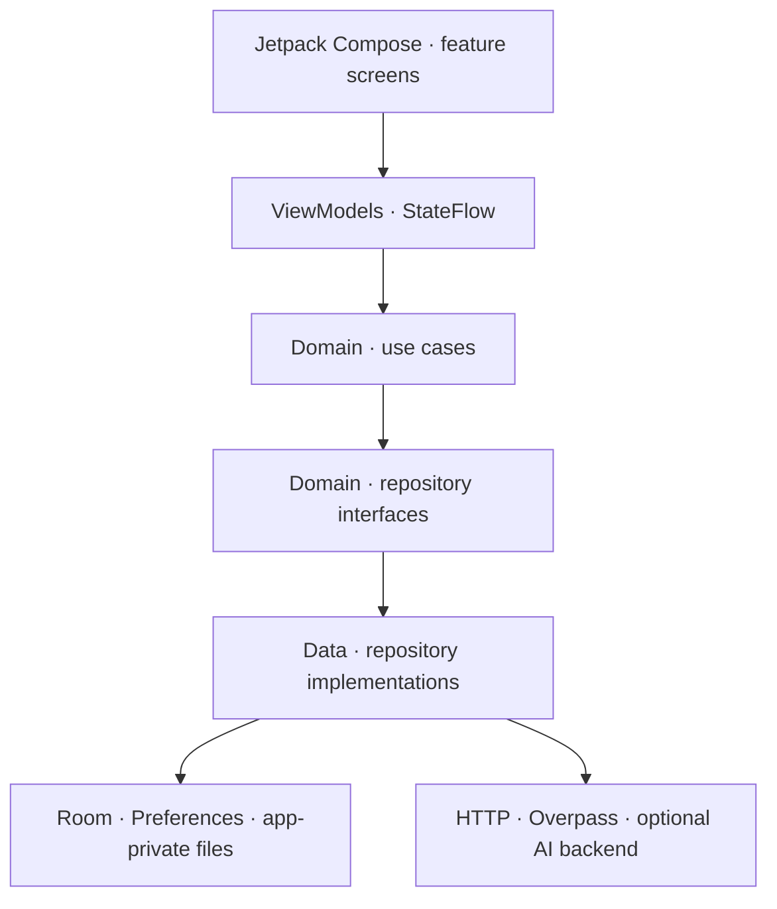

# Food Memory

**Memoria gastronómica personal para recordar qué probaste, qué te gustó y qué te apetece descubrir.**

Food Memory es una aplicación Android nativa creada como proyecto de portfolio. Permite guardar experiencias y platos, consultar lugares cercanos y explorar recomendaciones basadas en el historial del usuario. El foco del proyecto está en una arquitectura clara, persistencia local, integración con capacidades del dispositivo y límites explícitos para las funciones asistidas por IA.

> Proyecto de demostración en desarrollo. No es un producto comercial ni ofrece cuentas sincronizadas en la nube. Algunas funciones de IA dependen de un servicio local opcional; la interpretación de imágenes de platos usa actualmente una implementación demo.

## Funcionalidades

- **Experiencias gastronómicas:** registro de restaurantes, fecha, platos, valoraciones, precio, acompañantes, notas e imágenes.
- **Cámara:** captura de fotos de platos con CameraX y orientación corregida antes de guardar.
- **Persistencia local:** experiencias y relaciones entre restaurante, plato e ingredientes mediante Room; imágenes en almacenamiento privado; sesión de demostración persistida localmente.
- **Cerca:** mapa MapLibre, ubicación del dispositivo y búsqueda de bares y restaurantes próximos mediante OpenStreetMap/Overpass. Los resultados requieren conexión y disponibilidad del servicio de datos.
- **Perfil gastronómico:** estadísticas calculadas a partir de las experiencias guardadas y sugerencias derivadas de las valoraciones.
- **Recomendaciones con IA opcional:** servicio Node.js que puede conectarse a Gemini. Envía un perfil agregado mínimo y conserva sugerencias locales cuando no hay servicio disponible.
- **Internacionalización preparada:** recursos de interfaz en español e inglés y catálogos JSON en `translations/`.

## Arquitectura

La aplicación utiliza una estructura por capas dentro de un único módulo Android (`:app`). La UI está construida con Jetpack Compose y sigue el patrón MVVM.



### Responsabilidades

| Capa | Responsabilidad | Ejemplos |
| --- | --- | --- |
| `feature/` | Pantallas Compose y estado de presentación | `HomeScreen`, `NearbyScreen`, `ProfileViewModel` |
| `domain/model/` | Modelos independientes de Android | `FoodExperience`, `TasteProfile`, `NearbyRestaurant` |
| `domain/repository/` | Contratos que delimitan las fuentes de datos | `ExperienceRepository`, `TasteRecommendationRepository` |
| `domain/usecase/` | Acciones de negocio y coordinación | `AddExperienceUseCase`, `FindNearbyPlacesUseCase` |
| `data/local/` | Persistencia local | Room, DAOs, entidades y sesión local |
| `data/remote/` | Adaptadores de red | Overpass y clientes HTTP del backend de IA |
| `data/demo/` | Implementaciones demo y alternativas offline | análisis de imagen y sugerencias locales |
| `app/` | Composition root y construcción de dependencias | `AppContainer` y fábricas de ViewModel |

Las corrutinas y `Flow`/`StateFlow` mantienen las operaciones de disco y red fuera del hilo principal. Las interfaces del dominio permiten intercambiar implementaciones sin acoplar las pantallas a Room, HTTP o a un proveedor de IA.

## Stack técnico

- Kotlin y Android SDK
- Jetpack Compose y Material 3
- MVVM, separación por capas y Repository pattern
- Coroutines y Flow/StateFlow
- Room para datos relacionales locales
- CameraX y AndroidX ExifInterface
- MapLibre para la representación del mapa
- OpenStreetMap Overpass API para lugares cercanos
- Node.js para el backend opcional de recomendaciones
- Gemini como proveedor remoto opcional
- Gradle Kotlin DSL y catálogo centralizado de dependencias

## Flujo de recomendaciones con IA

La IA remota es opcional y está desacoplada mediante `TasteRecommendationRepository`. El perfil deriva primero de los datos locales; si se configura el backend, la app envía nombres y puntuaciones agregadas de platos y restaurantes bien valorados. El servidor genera y valida una respuesta estructurada. La UI conserva recomendaciones locales basadas en valoraciones cuando el backend no responde.

La captura y análisis de una imagen de plato usa actualmente `DemoDishAnalysisRepository`: es un punto de sustitución arquitectónico, no un análisis remoto real habilitado en la app actual. La demo evita incluir claves de proveedor en el APK. No se deben añadir secretos a este repositorio.

Detalles: [`docs/AI_RECOMMENDATIONS.md`](docs/AI_RECOMMENDATIONS.md).

## Ejecutar el proyecto

1. Clona el repositorio y ábrelo en Android Studio.
2. Usa JDK 11 o la versión requerida por el Gradle Wrapper del proyecto y sincroniza Gradle.
3. Ejecuta la configuración `app` en un emulador o dispositivo Android. El `minSdk` actual es 24.
4. Para lugares cercanos, concede permiso de ubicación mientras usas la app y habilita la ubicación del emulador/dispositivo.

La app compila sin credenciales de IA. El endpoint de desarrollo por defecto apunta al emulador (`http://10.0.2.2:8080/`); las recomendaciones remotas permanecen opcionales.

### Backend opcional de IA

Requiere Node.js 18 o superior y una clave de Gemini. Desde la raíz del proyecto:

```sh
cp backend/.env.example backend/.env
# Añade GEMINI_API_KEY en backend/.env
node backend/server.mjs
```

`backend/.env` está excluido de Git. Para un despliegue fuera del emulador, configura una URL HTTPS mediante la propiedad Gradle `foodMemoryApiBaseUrl`; no publiques un servidor de demo sin revisar autenticación, cuotas, límites de uso y privacidad.

## Datos y privacidad

- Las experiencias, restaurantes, platos e ingredientes se guardan localmente en Room.
- Las fotos de platos se guardan en el almacenamiento privado de la aplicación.
- La sesión es local y sirve para demostrar persistencia de estado; no equivale a autenticación de servidor.
- El mapa consulta proveedores externos y comparte con ellos la ubicación aproximada necesaria para buscar lugares cercanos.
- Las recomendaciones remotas son opcionales. Las solicitudes de recomendación usan datos agregados; las notas personales, acompañantes e imágenes no se envían en ese flujo.
- No se versionan `local.properties`, archivos `.env`, claves, keystores, APKs ni bundles.

Consulta también [`backend/README.md`](backend/README.md) para conocer el flujo de datos del servicio.

## Calidad y pruebas

Pruebas unitarias e instrumentadas viven en `app/src/test/` y `app/src/androidTest/`. Incluyen, entre otros, ordenación española con tildes y persistencia del repositorio Room. Para ejecutarlas localmente:

```sh
./gradlew :app:testDebugUnitTest :app:assembleDebug
```

## Estructura del repositorio

```text
app/             Aplicación Android, capas y pruebas
backend/         Servicio Node.js opcional para recomendaciones con IA
docs/            Decisiones de arquitectura y tokens de diseño
translations/    Catálogos JSON en inglés y español
```

## Estado y próximos pasos

Food Memory es una demo técnica: ubicación y consulta de lugares necesitan red; las recomendaciones Gemini necesitan configurar y desplegar el backend; el análisis de la foto está sustituido por una implementación demo. Antes de una publicación en tienda habría que completar revisión de privacidad, accesibilidad, identidad de paquete, firma de release, configuración HTTPS de producción, ficha y política de privacidad, y pruebas en dispositivos físicos.

## Desarrollo asistido por IA

Codex se utiliza como herramienta de apoyo para explorar cambios, implementar tareas acotadas y revisar resultados. Las decisiones de arquitectura, el diff, los casos límite y la validación de compilación/pruebas se revisan manualmente. La herramienta no sustituye la revisión técnica del código ni la responsabilidad sobre los cambios publicados.

## Autor

**Samuel López Lemasurier** · Mobile Developer (iOS / Android)

Este repositorio se comparte como muestra técnica para evaluación profesional. No se concede una licencia de reutilización del código salvo que se añada una licencia explícita en el futuro.
