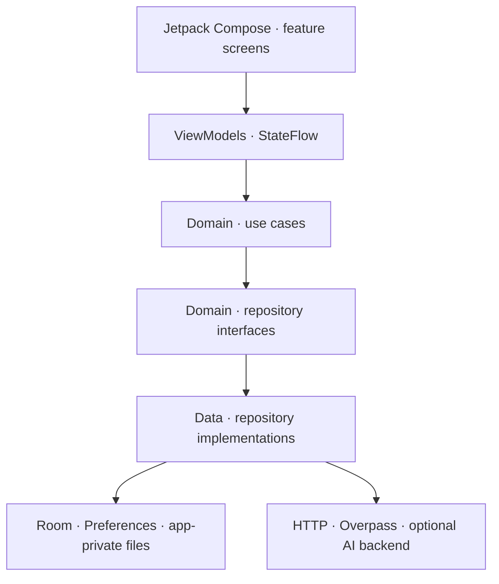
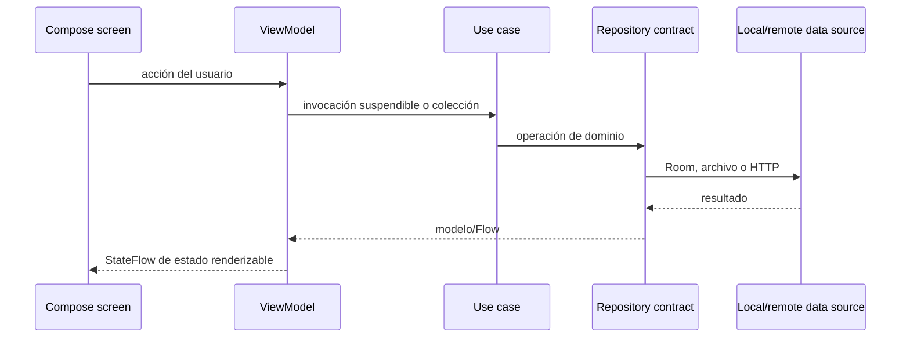
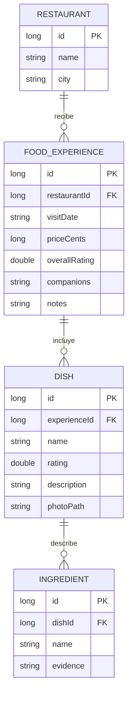

# Food Memory

**Memoria gastronómica personal para recordar qué probaste, qué te gustó y qué te apetece descubrir.**

Food Memory es una aplicación Android nativa creada como proyecto de portfolio. Permite guardar experiencias y platos, consultar lugares cercanos y explorar recomendaciones basadas en el historial del usuario. El foco del proyecto está en una arquitectura clara, persistencia local, integración con capacidades del dispositivo y límites explícitos para las funciones asistidas por IA.

> Proyecto de demostración en desarrollo. No es un producto comercial ni ofrece cuentas sincronizadas en la nube. Algunas funciones de IA dependen de un servicio local opcional; la interpretación de imágenes de platos usa actualmente una implementación demo.

## Funcionalidades

- **Experiencias gastronómicas:** registro de restaurantes, fecha, platos, valoraciones, precio, acompañantes, notas e imágenes.
- **Cámara:** captura de fotos de platos con CameraX y orientación corregida antes de guardar.
- **Persistencia local:** experiencias y relaciones entre restaurante, plato e ingredientes mediante Room; imágenes en almacenamiento privado; sesión de demostración persistida localmente.
- **Cerca:** mapa MapLibre, ubicación del dispositivo y búsqueda de bares y restaurantes próximos mediante OpenStreetMap/Overpass. Los resultados requieren conexión y disponibilidad del servicio de datos.
- **Perfil gastronómico:** estadísticas calculadas a partir de las experiencias guardadas y sugerencias derivadas de las valoraciones.
- **Recomendaciones con IA opcional:** servicio Node.js que puede conectarse a Gemini. Envía un perfil agregado mínimo y conserva sugerencias locales cuando no hay servicio disponible.
- **Internacionalización preparada:** recursos de interfaz en español e inglés y catálogos JSON en `translations/`.

## Objetivo y alcance

Food Memory resuelve un problema personal: después de visitar restaurantes, es fácil olvidar qué se pidió, cuánto gustó un plato y si merece la pena volver. La app convierte esas salidas en un historial consultable y utiliza las valoraciones explícitas para calcular un perfil gastronómico.

El MVP se centra en tres recorridos: guardar una experiencia, consultar lugares próximos y ver ideas derivadas del propio historial. No incluye una red social, reservas, pedidos, pagos ni herramientas para gestionar restaurantes. El formulario de sesión es local y demostrativo; no existe un sistema de identidad remoto ni sincronización entre dispositivos.

## Navegación y recorridos principales

La navegación Compose está centralizada en `navigation/FoodMemoryNavigation.kt` y modela Inicio, Cerca, Perfil, captura de plato, formulario de experiencia y análisis de carta.

1. **Inicio de sesión:** al abrirse, se lee la sesión local. Si existe, la navegación muestra Inicio; si no, presenta el formulario. Al iniciar sesión se solicita ubicación mientras se usa la app.
2. **Guardar una salida:** el formulario prepara un `NewExperience`; `AddExperienceUseCase` delega la operación al repositorio Room, que inserta restaurante, experiencia, platos e ingredientes en una transacción. Room emite la lista actualizada a Inicio.
3. **Añadir plato con foto:** CameraX captura la imagen en caché temporal, corrige su orientación y presenta el resultado para revisión. Al confirmar, el archivo se copia al almacenamiento privado de la app y su ruta se guarda con el plato. La navegación devuelve el plato al formulario mediante `SavedStateHandle`.
4. **Consultar Cerca:** con permiso, `NearbyViewModel` recibe ubicación y busca bares/restaurantes mediante Overpass. MapLibre representa el mapa; los controles de categoría, búsqueda y ordenación filtran la lista. El orden alfabético usa colación `es-ES`, tratando vocales acentuadas como su letra base.
5. **Ver el perfil:** el dominio calcula platos y restaurantes mejor valorados y gasto medio a partir de los registros locales. Si hay historial, se muestran sugerencias deterministas inmediatamente mientras el ViewModel solicita las sugerencias remotas.

## Arquitectura

La aplicación utiliza una estructura por capas dentro de un único módulo Android (`:app`). La UI está construida con Jetpack Compose y sigue el patrón MVVM.



### Responsabilidades

| Capa | Responsabilidad | Ejemplos |
| --- | --- | --- |
| `feature/` | Pantallas Compose y estado de presentación | `HomeScreen`, `NearbyScreen`, `ProfileViewModel` |
| `domain/model/` | Modelos independientes de Android | `FoodExperience`, `TasteProfile`, `NearbyRestaurant` |
| `domain/repository/` | Contratos que delimitan las fuentes de datos | `ExperienceRepository`, `TasteRecommendationRepository` |
| `domain/usecase/` | Acciones de negocio y coordinación | `AddExperienceUseCase`, `FindNearbyPlacesUseCase` |
| `data/local/` | Persistencia local | Room, DAOs, entidades y sesión local |
| `data/remote/` | Adaptadores de red | Overpass y clientes HTTP del backend de IA |
| `data/demo/` | Implementaciones demo y alternativas offline | análisis de imagen y sugerencias locales |
| `app/` | Composition root y construcción de dependencias | `AppContainer` y fábricas de ViewModel |

Las corrutinas y `Flow`/`StateFlow` mantienen las operaciones de disco y red fuera del hilo principal. Las interfaces del dominio permiten intercambiar implementaciones sin acoplar las pantallas a Room, HTTP o a un proveedor de IA.

### Flujo de datos



### Decisiones de implementación

- **MVVM:** cada flujo de pantalla expone estado observable desde un `ViewModel`; Compose representa ese estado y envía eventos. Las pantallas recopilan estado con `collectAsStateWithLifecycle`.
- **Clean Architecture ligera:** entidades/modelos de dominio y contratos no dependen de Compose, Room ni de Gemini. Los casos de uso nombran operaciones concretas y son puntos de prueba.
- **Inyección de dependencias explícita:** `AppContainer` es el composition root que construye repositorios, casos de uso y fábricas de ViewModel. No se introduce un framework DI en esta demo pequeña.
- **Persistencia transaccional:** Room agrupa el alta de restaurante, visita, platos e ingredientes con `withTransaction`; las consultas relacionales se transforman a modelos de dominio antes de llegar a UI. El esquema se versiona y la migración `1 → 2` añade descripción/foto e ingredientes.
- **Separación de caché y almacenamiento permanente:** CameraX escribe primero en `cacheDir`; al confirmar, el repositorio copia la imagen a `filesDir/dish-photos` usando un archivo temporal y renombrado para evitar guardar una copia parcial.
- **Estado de sesión de demo:** `PreferencesSessionRepository` persiste nombre/correo/id localmente en `SharedPreferences`. Esto mantiene la sesión entre aperturas, pero no autentica ni verifica al usuario en servidor.
- **Errores y cancelación:** las operaciones remotas se representan como estados de carga, resultado o error; `ProfileViewModel` propaga `CancellationException` para no convertir cancelaciones de ciclo de vida en errores visibles y mantiene el fallback local ante fallos de red.

### Modelo persistido



El precio se conserva en céntimos (`priceCents`) para evitar errores de redondeo propios de `Float`/`Double`. La base local se llama `food-memory.db`; Room exporta sus esquemas a `app/schemas/`.

### Sincronía y asincronía

- La UI y la navegación ejecutan en el hilo principal; no hacen directamente operaciones de disco ni llamadas de red.
- Las operaciones suspendibles de sesión, fotos, Overpass y HTTP se mueven a `Dispatchers.IO` o a ejecutores de CameraX.
- Room expone cambios como `Flow`; los ViewModels los combinan y publican como `StateFlow` para mantener Inicio/Perfil actualizados tras un guardado.
- Los eventos discretos (por ejemplo, guardar una experiencia) se lanzan desde `viewModelScope`; tareas continuas se cancelan con el ciclo de vida del ViewModel.
- Las llamadas a servicios externos tienen timeout y errores traducidos a estados recuperables cuando corresponde. Los servicios públicos de mapa siguen sujetos a disponibilidad y límites de terceros.

## Cámara y análisis de imágenes

La pantalla `DishCaptureScreen` integra CameraX Preview e ImageCapture. La captura prioriza latencia, impide dobles pulsaciones mientras escribe, establece la rotación actual, normaliza orientación EXIF y ofrece la imagen capturada para revisar/editar nombre, descripción e ingredientes.

La interfaz y los contratos de análisis (`DishAnalysisRepository`, `AnalyzeDishPhotoUseCase`) están preparados para reemplazar la fuente demo. **La configuración activa en `AppContainer` es `DemoDishAnalysisRepository`**, por lo que no se debe presentar la detección de plato/ingredientes como una llamada real de IA en la versión actual. Existe un adaptador HTTP como base de integración, pero no está conectado al flujo activo de captura.

## Mapa y búsqueda de lugares

- La ubicación se pide en contexto, al iniciar sesión, con permiso de primer plano; no se solicita ubicación en segundo plano.
- `NearbyViewModel` coordina permisos, ubicación actual/reciente, frecuencia de búsqueda, estados de carga y reintentos al abrir la pantalla.
- El cliente consulta Overpass API (datos de OpenStreetMap) en paralelo contra endpoints públicos y utiliza el primer resultado satisfactorio. Hay caché en memoria por zona; no es un proveedor comercial ni garantiza disponibilidad.
- MapLibre dibuja el estilo Liberty de OpenFreeMap y los marcadores; el mapa se precalienta detrás de Inicio cuando ya existe ubicación para reducir la espera visual al entrar en Cerca.
- Una caída de red, falta de permiso, GPS desactivado o límites del endpoint puede dejar temporalmente la lista vacía. La UI comunica esos estados y permite reintentar.
- El filtro/buscador/orden de la lista no modifica los datos de OpenStreetMap. El orden por nombre se localiza con `Collator` español; la distancia se recalcula al recibir una posición nueva.

## Perfil e IA

El perfil personal es determinista y basado en historial: el caso de uso selecciona platos y restaurantes con valoración ≥ 4/5, limita los destacados a tres y calcula el gasto medio con experiencias que tengan precio. Con historial vacío no se infieren gustos.

La integración remota de recomendaciones es opcional:

1. `ProfileViewModel` observa los cambios de Room y construye `TasteProfile`.
2. `DemoTasteRecommendationRepository` presenta una alternativa local rápida y reproducible.
3. `HttpTasteRecommendationRepository` puede enviar al backend solo nombres y puntuaciones agregados de favoritos y lugares a repetir.
4. El servidor Node.js valida los datos, llama a Gemini con una salida estructurada y filtra restaurantes para no sugerir lugares ajenos al historial.
5. Si falta red, clave o hay una respuesta inválida, la app conserva las sugerencias locales.

La clave `GEMINI_API_KEY` reside en `backend/.env`, excluido por Git. No se incluye en el APK. El backend no almacena fotos ni solicitudes. Aun así, cualquier despliegue real necesitaría autenticación, HTTPS, cuotas y revisión de privacidad/retención del proveedor.

Diseño detallado: [`docs/AI_RECOMMENDATIONS.md`](docs/AI_RECOMMENDATIONS.md).

## Stack técnico

- Kotlin y Android SDK
- Jetpack Compose y Material 3
- MVVM, separación por capas y Repository pattern
- Coroutines y Flow/StateFlow
- Room para datos relacionales locales
- CameraX y AndroidX ExifInterface
- MapLibre para la representación del mapa
- OpenStreetMap Overpass API para lugares cercanos
- Node.js para el backend opcional de recomendaciones
- Gemini como proveedor remoto opcional
- Gradle Kotlin DSL y catálogo centralizado de dependencias

## Organización del código

```text
app/src/main/java/com/example/foodmemory/
├── app/                 # aplicación, composition root y scaffold
├── data/
│   ├── demo/            # fuentes reproducibles de demostración
│   ├── local/           # Room, DAO, entidades, sesión y fotos
│   ├── remote/          # adaptadores HTTP y Overpass
│   └── repository/      # implementación Room de contratos de dominio
├── domain/
│   ├── model/           # modelos de negocio
│   ├── repository/      # interfaces de acceso a datos
│   └── usecase/         # operaciones y reglas de negocio
├── feature/             # pantallas y ViewModels por área funcional
├── navigation/          # destinos, rutas y resultados entre pantallas
└── ui/theme/            # colores, tipografía, tokens y tema Compose
```

El proyecto mantiene un solo módulo Gradle (`:app`) a propósito: las capas se separan por responsabilidad y paquetes, mientras la demo evita módulos Gradle adicionales que no aportarían una frontera funcional real en su alcance actual.

### Convenciones para seguir desarrollando

- Añadir texto de interfaz a `strings.xml`/`values-en/strings.xml`, no escribir copy visible directamente en las pantallas.
- Mantener paleta, tipografía, espaciados, tamaños y esquinas compartidos en `ui/theme/`.
- Las pantallas emiten eventos; la lógica y la coordinación asíncrona viven en ViewModels/casos de uso.
- Mantener acceso a red y almacenamiento detrás de repositorios; no filtrar DTOs/entidades de infraestructura a Compose.
- Validar y revisar cualquier dato de IA antes de convertirlo en datos persistidos o preferencia real del usuario.
- Añadir migraciones Room explícitas y actualizar esquemas exportados cuando cambie el modelo persistido.

Tokens visuales actuales: [`docs/DESIGN_TOKENS.md`](docs/DESIGN_TOKENS.md). Los catálogos fuente para idiomas: [`translations/en.json`](translations/en.json) y [`translations/es.json`](translations/es.json).

## Datos y privacidad

- Las experiencias, restaurantes, platos e ingredientes se guardan localmente en Room.
- Las fotos de platos se guardan en el almacenamiento privado de la aplicación.
- La sesión es local y sirve para demostrar persistencia de estado; no equivale a autenticación de servidor.
- El mapa consulta proveedores externos y comparte con ellos la ubicación aproximada necesaria para buscar lugares cercanos.
- Las recomendaciones remotas son opcionales. Las solicitudes de recomendación usan datos agregados; las notas personales, acompañantes e imágenes no se envían en ese flujo.
- No se versionan `local.properties`, archivos `.env`, claves, keystores, APKs ni bundles.

Consulta también [`backend/README.md`](backend/README.md) para conocer el flujo de datos del servicio.

## Calidad y pruebas

Pruebas unitarias e instrumentadas viven en `app/src/test/` y `app/src/androidTest/`.

| Prueba | Tipo | Qué protege |
| --- | --- | --- |
| `RestaurantSortingTest` | Unit test JVM | Vocales con tilde ordenadas con su letra base en español, ascendente/descendente |
| `RoomExperienceRepositoryTest` | Android instrumentation | Relaciones de experiencia tras cerrar/reabrir Room y copia completa de foto al almacenamiento privado |

Ejecución desde la raíz del repositorio:

```sh
./gradlew :app:testDebugUnitTest :app:assembleDebug
# En un emulador/dispositivo con Android Test Orchestrator no requerido:
./gradlew :app:connectedDebugAndroidTest
```

Gradle puede necesitar descargar dependencias en la primera ejecución. Los tests instrumentados requieren un emulador o dispositivo conectado; los unit tests JVM no.

## Estructura del repositorio

```text
app/             Aplicación Android, capas y pruebas
backend/         Servicio Node.js opcional para recomendaciones con IA
docs/            Decisiones de arquitectura y tokens de diseño
translations/    Catálogos JSON en inglés y español
```

## Ejecutar el proyecto

### Android

1. Clona el repositorio y ábrelo en Android Studio.
2. Deja que el IDE sincronice Gradle e instale el Android SDK requerido por `compileSdk`; utiliza el JDK que configura el Gradle Wrapper/Android Studio.
3. Selecciona la configuración `app` y ejecuta en un dispositivo/emulador compatible (Android 7.0/API 24 o posterior).
4. Para probar fotos, concede permiso de cámara. Para Cerca, concede ubicación mientras se usa la app y configura una posición en el emulador.

La app no requiere credenciales para compilar o probar sus recorridos locales. `local.properties` se genera para cada máquina y está excluido de Git. El endpoint Android de desarrollo por defecto es `http://10.0.2.2:8080/`, la dirección del host vista desde el emulador.

### Backend opcional de IA

Requiere Node.js 18+ y una clave de Gemini. Desde la raíz del proyecto:

```sh
cp backend/.env.example backend/.env
# Añade GEMINI_API_KEY en backend/.env; no la incluyas en Git.
node backend/server.mjs
```

Comprueba disponibilidad con `GET /health`. Para utilizar un backend desplegado fuera del emulador, configura `foodMemoryApiBaseUrl` como propiedad Gradle y usa HTTPS. La ruta local en HTTP solo sirve para desarrollo del emulador. `backend/.env` está excluido de Git. No despliegues este servidor de demo sin autenticación, controles de uso y revisión de privacidad.

Detalles operativos: [`backend/README.md`](backend/README.md).

## Limitaciones conocidas y preparación para release

- La sesión es una identidad local de muestra, no autenticación segura ni sincronización de cuenta.
- El análisis de imagen está en modo demo en el composition root actual. Las recomendaciones remotas requieren backend desplegado y clave Gemini configurada solo en servidor.
- La búsqueda cercana depende de ubicación concedida, red y servicios públicos de Overpass/OpenStreetMap.
- No se ha publicado una versión en Play Store ni se ofrece un APK de release firmado en este repositorio.
- El package/application id sigue siendo `com.example.foodmemory`, adecuado para demo pero pendiente de reemplazo antes de una publicación formal.
- Antes de release: definir identidad de paquete y firma/keystore seguros, desplegar API HTTPS con controles de uso, revisar privacidad/retención, accesibilidad, permisos, clasificación de contenido y política de privacidad, y validar en dispositivos físicos. Nunca subir claves o keystores al repositorio.

## Desarrollo asistido por IA

Codex se utiliza como herramienta de apoyo para explorar cambios, implementar tareas acotadas y revisar resultados. Las decisiones de arquitectura, el diff, los casos límite y la validación de compilación/pruebas se revisan manualmente. La herramienta no sustituye la revisión técnica del código ni la responsabilidad sobre los cambios publicados.

## Autor

**Samuel López Lemasurier** · Mobile Developer (iOS / Android)

Este repositorio se comparte como muestra técnica para evaluación profesional. No se concede una licencia de reutilización del código salvo que se añada una licencia explícita en el futuro.
