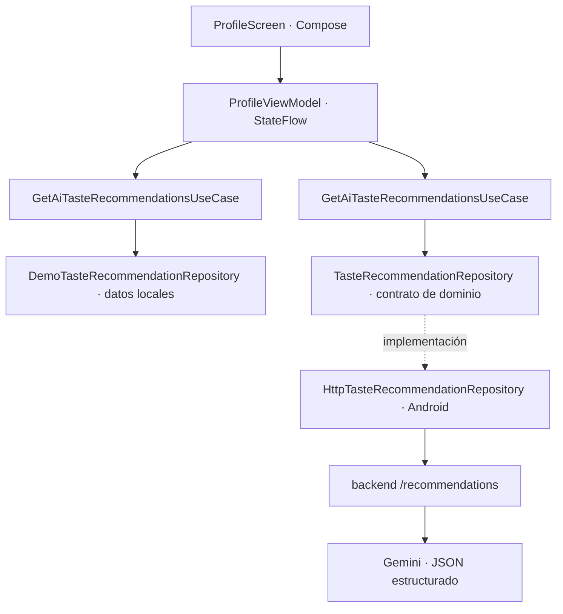

# Recomendaciones con IA: arquitectura de la demo

Food Memory separa la recomendación gastronómica en capas para poder cambiar el proveedor sin que la interfaz dependa de Gemini.

## Flujo

1. Room emite las experiencias guardadas; el dominio calcula platos y restaurantes mejor valorados.
2. La pantalla publica inmediatamente sugerencias deterministas generadas solo con esas valoraciones. Así el perfil sigue siendo útil sin red ni clave de IA.
3. En paralelo, el adaptador Android envía al backend exclusivamente los nombres y puntuaciones agregados de platos y restaurantes favoritos.
4. El backend construye una petición acotada a Gemini, valida el esquema JSON y filtra restaurantes para que solo puedan ser lugares presentes en el historial.
5. La app valida de nuevo el JSON y presenta las recomendaciones remotas. Si hay timeout, error o respuesta vacía conserva la alternativa local.

## Decisiones de arquitectura y privacidad

- `TasteRecommendationRepository` es el límite del dominio; ViewModel y Compose no conocen HTTP ni Gemini.
- `GetAiTasteRecommendationsUseCase` representa la acción de negocio y permite cambiar implementaciones o probarlas aisladamente.
- `HttpTasteRecommendationRepository` trabaja en IO, transmite solo el perfil agregado y valida tipo, nombre y explicación.
- `DemoTasteRecommendationRepository` es la alternativa reproducible offline; cada idea tiene una valoración real como evidencia.
- La clave Gemini vive únicamente en `backend/.env`, fuera del APK. El backend no persiste ni registra las solicitudes.
- Las sugerencias de platos se presentan como ideas, nunca como preferencias que el usuario haya expresado. Los restaurantes no se inventan.

## Ejecución local

Configura `GEMINI_API_KEY` en `backend/.env` usando `backend/.env.example` como referencia y ejecuta `node backend/server.mjs`. El emulador Android llega al Mac mediante `http://10.0.2.2:8080/`. `GET /health` permite revisar disponibilidad sin revelar la clave.
